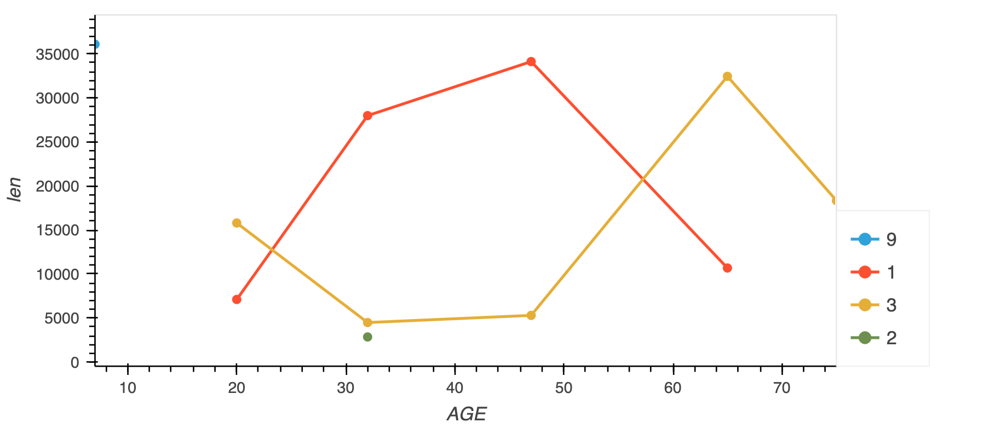
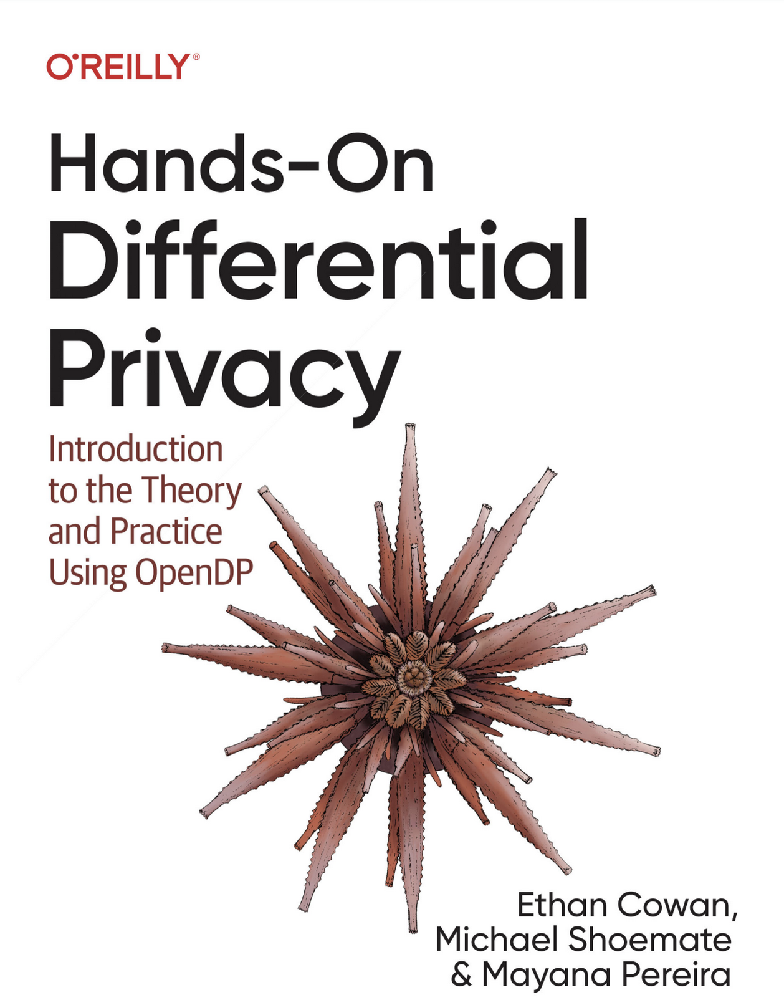

## Outline

- Introduction
  - What is Privacy?
  - What is Differential Privacy?
  - What is Open Differential Privacy? (OpenDP)
- OpenDP Library
  - Context API
  - Tabular Data
  - Framework API
  - Programming Framework
  - Plugins

## What is Privacy?

> Keeping information specific to an individual secret, privileged or protected.

## What is Privacy?

> Keeping information specific to an individual secret, privileged or protected.

- Secret to whom?
- Under what conditions can information be shared?

## What is Privacy?

> Keeping information specific to an individual secret, privileged or protected.

- Data Privacy Practices
  - Encryption
  - Access control
  - Data minimization
  - De-identification

## What is Privacy?

> Keeping information specific to an individual secret, privileged or protected.

- Privacy Enhancing Technologies
  - Input Privacy
    - Multiple parties collaboratively compute, but no one party can access another party's data
    - Examples: Homomorphic Encryption, Secure Multiparty Computation, Trusted Execution Environments
  - Output Privacy
    - Output of a computation does not reveal sensitive information about individuals in the data
    - Examples: Differential Privacy, k-Anonymity, l-diversity

## What is Differential Privacy?

_Differential privacy_ is a definition of privacy that mathematically quantifies 
how much a data release can reveal about any one person in the data.

## What is Differential Privacy?

_Differential privacy_ is a definition of privacy that mathematically quantifies 
how much a data release can reveal about any one person in the data.

These data releases may be:

- descriptive statistics like counts, sums, means, quantiles
- descriptive statistics under grouping, like contingency tables, cross-tabulations
- machine learning models
- synthetic data
- statistical models like regression, decision trees, PCA, etc

## What is Differential Privacy?

_Differential privacy_ is a definition of privacy that mathematically quantifies 
how much a data release can reveal about any one person in the data.

"Differential" in the sense that the technology obscures the difference between data releases on data sets that differ by one individual.

## What is Differential Privacy?

_Differential privacy_ is a definition of privacy that mathematically quantifies 
how much a data release can reveal about any one person in the data.

Why we use it:

- Meaningful
  - Protects every individual
  - Robust against any adversary
  - Immune to auxiliary information
- Quantifiable
  - Bounded "privacy loss"
  - Mathematically rigorous
  - Allows for interactivity

## What is Differential Privacy?

_Differential privacy_ is a definition of privacy that mathematically quantifies 
how much a data release can reveal about any one person in the data.

How it is applied:

- add a "small" amount of random noise into statistical computations
- careful application of data pre-processing when appropriate

When applied correctly, an estimator/algorithm/mechanism can be shown to "satisfy" differential privacy.

## What is Differential Privacy?

_Differential privacy_ is a definition of privacy that mathematically quantifies 
how much a data release can reveal about any one person in the data.

Example count algorithm:

1. compute number of records in dataset
2. add noise from the laplace distribution

The "privacy loss" of sharing the outcome of this algorithm 
depends on how many records an individual can contribute to the data,
and how much noise is added.

## What is Open Differential Privacy? (OpenDP)

_OpenDP_ is a community effort to build a trustworthy and open-source suite of differential privacy tools 
that can be easily adopted by custodians of sensitive data to make data releases for research and exploration in the public interest.

## What is Open Differential Privacy? (OpenDP)

OpenDP is a *community effort* to build a trustworthy and open-source suite of differential privacy tools 
that can be easily adopted by custodians of sensitive data to make data releases for research and exploration in the public interest.

- Slack Workspace
- Community Working Groups
- OpenDP Community Meeting
- Software is open to contribution

## What is Open Differential Privacy? (OpenDP)

OpenDP is a community effort to build a *trustworthy* and open-source suite of differential privacy tools 
that can be easily adopted by custodians of sensitive data to make data releases for research and exploration in the public interest.

- designed in a way that facilitates writing proofs for each function
- well-defined privacy semantics enforced through the OpenDP Programming Framework
- vetting process for checking proofs and code

## What is Open Differential Privacy? (OpenDP)

OpenDP is a community effort to build a trustworthy and *open-source* suite of differential privacy tools 
that can be easily adopted by custodians of sensitive data to make data releases for research and exploration in the public interest.

- GitHub: https://github.com/opendp
  - _OpenDP Library_
  - Tumult Analytics
  - SmartNoise SDK
  - DP Wizard

## What is Open Differential Privacy? (OpenDP)

OpenDP is a community effort to build a trustworthy and open-source suite of differential privacy tools 
that can be _easily adopted_ by custodians of sensitive data to make data releases for research and exploration in the public interest.

- Documentation:
  - _OpenDP Library_: https://docs.opendp.org
  - Tumult Analytics: https://docs.tmlt.dev/platform/latest/index.html
  - SmartNoise SDK: https://docs.smartnoise.org/
  - DP Wizard: https://pypi.org/project/dp_wizard/

## What is Open Differential Privacy? (OpenDP)

OpenDP is a community effort to build a trustworthy and open-source suite of differential privacy tools 
that can be easily adopted by custodians of sensitive data to make *data releases* for research and exploration in the public interest.

- descriptive statistics like counts, sums, means, quantiles
- descriptive statistics under grouping, like contingency tables, cross-tabulations
- synthetic data (upcoming)
- statistical models like linear regression, PCA

## What is Open Differential Privacy? (OpenDP)

OpenDP is a community effort to build a trustworthy and open-source suite of differential privacy tools 
that can be easily adopted by custodians of sensitive data to make data releases for *research and exploration in the public interest*.

- UN High Comissioner for Refugees (UNHCR) 
    - to create synthetic microdata for refugee populations
- Swiss Federal Statistical Office 
    - to prototype tools to release income statistics
    - Lomas, a platform for remote data science
- Microsoft
    - United States Broadband Percentages Database
    - Atlas of internet usage in the US
- Oblivious 
    - for major UN and telecom pilot projects
    - for Antigranular, a data privacy platform
- OpenMined and ChristChurch Call 
    - audit of recommender systems with Microsoft and DailyMotion


## OpenDP Library Setup

First install and import the required dependencies:

```shell
%pip install opendp[polars] --pre
```

```python
>>> import opendp.prelude as dp
>>> import polars as pl
>>>
>>> # The OpenDP team is working to vet algorithms used in these slides.
>>> # Until that is complete we need to opt-in to use these features.
>>> dp.enable_features("contrib")

```

## Example Dataset
[Labour Force Survey microdata](https://ec.europa.eu/eurostat/web/microdata/public-microdata/labour-force-survey) released by Eurostat
surveys working hours of individuals in the European Union collected on a quarterly cadence

```python
>>> lfs_data = pl.scan_csv(dp.examples.get_france_lfs_path(), ignore_errors=True)

```

Relevant columns:

- SEX: 1 | 2
- AGE: integer
- ILOSTAT: Labour status during the reference week
- HWUSUAL: Number of Hours Per Week Usually Worked
- QUARTER
- YEAR


## Context API

```python
>>> context = dp.Context.compositor(
...    data=lfs_data,
...    privacy_unit=dp.unit_of(contributions=36),
...    privacy_loss=dp.loss_of(epsilon=1.0),
...    split_evenly_over=5,
... )

```

- privacy unit: the greatest influence an individual may have on your dataset
    - what the "protected change" is
- privacy loss: the greatest loss in privacy any one individual may suffer in your dataset
    - how much advantage an adversary can gain from the release

## Context API

```python
>>> context = dp.Context.compositor(
...    data=lfs_data,
...    privacy_unit=dp.unit_of(contributions=36),
...    privacy_loss=dp.loss_of(epsilon=1.0),
...    split_evenly_over=5,
... )

```

- privacy unit: pessimistic upper bound based on the number of quarters in the data
    - 4 quarters across 9 years
- privacy loss: for central-DP with aggregate statistics, `epsilon = 1` is a safe default

## Context API

```python
>>> context = dp.Context.compositor(
...    data=lfs_data,
...    privacy_unit=dp.unit_of(contributions=36),
...    privacy_loss=dp.loss_of(epsilon=1.0),
...    split_evenly_over=5,
... )

```

Intuition: Differential privacy is a specialized constraint on the stability of a function.

Functional stability is a property that, given a bounded change in the input to a function, 
you know the output has a bounded change.

Here, we set a bound on how much the input can change (the privacy unit),
and a bound on how much the output can change (the privacy loss).

## Context API

```python
>>> context = dp.Context.compositor(
...    data=lfs_data,
...    privacy_unit=dp.unit_of(contributions=36),
...    privacy_loss=dp.loss_of(epsilon=1.0),
...    split_evenly_over=5,
... )

```

- APIs similar to existing data science libraries

## Polars Count

A simple count of the number of individuals in the data.

```python
>>> query_num_responses = context.query().select(dp.len())

```

## Polars Count

A simple count of the number of individuals in the data.

```python
>>> query_num_responses = context.query().select(dp.len())

```

With statistical significance `alpha = 0.05`, or equivalently with 95% confidence...

```python
>>> query_num_responses.summarize(alpha=0.05)
shape: (1, 5)
┌────────┬──────────────┬─────────────────┬───────┬────────────┐
│ column ┆ aggregate    ┆ distribution    ┆ scale ┆ accuracy   │
│ ---    ┆ ---          ┆ ---             ┆ ---   ┆ ---        │
│ str    ┆ str          ┆ str             ┆ f64   ┆ f64        │
╞════════╪══════════════╪═════════════════╪═══════╪════════════╡
│ len    ┆ Frame Length ┆ Integer Laplace ┆ 180.0 ┆ 539.731115 │
└────────┴──────────────┴─────────────────┴───────┴────────────┘

```

...the true estimate will differ from the noisy estimate by at most 540.

## Polars Count

A simple count of the number of individuals in the data.

```python
>>> query_num_responses = context.query().select(dp.len())

```

Assuming the privacy-utility tradeoff is acceptable, submit the query:
```python
>>> query_num_responses.release().collect() # doctest: +SKIP
shape: (1, 1)
┌─────────┐
│ len     │
│ ---     │
│ u32     │
╞═════════╡
│ 3811915 │
└─────────┘

```

This consumes a portion of the privacy budget.


## Polars Sum

OpenDP properly accounts for all sources of numerical imprecision and potential overflow 
in both the implementation of the function, as well as in the privacy analysis.

```python
>>> context = dp.Context.compositor(
...    data=lfs_data,
...    privacy_unit=dp.unit_of(contributions=36),
...    privacy_loss=dp.loss_of(epsilon=1.0),
...    split_evenly_over=5,
...    margins=[
...         dp.polars.Margin(
...             # the length of the data is no greater than
...             #    average quarterly survey size (public)
...             #    * number of quarters (public)
...             max_length=150_000 * 36
...             # Remember to only use public information
...         ),
...     ],
... )

```

- Privacy guarantee is valid only if the data has at most `max_length` records.
- Recommended best practice is to only ever create one Context


## Polars Sum

```python
>>> query_work_hours = (
...     context.query()
...     .filter(pl.col.HWUSUAL != 99.0)
...     .select(
...         pl.col.HWUSUAL.cast(int).fill_null(35).dp.mean(bounds=(0, 80))
...     )
... )

```

Preprocessing:

- filter
- cast
- imputation
- clipping

## Polars Sum

```python
>>> query_work_hours = (
...     context.query()
...     .filter(pl.col.HWUSUAL != 99.0)
...     .select(
...         pl.col.HWUSUAL.cast(int).fill_null(35).dp.mean(bounds=(0, 80))
...     )
... )

```

With 95% confidence, the DP sum release will differ from the exact sum by at most 86,000.
```python
>>> query_work_hours.summarize(alpha=0.05)
shape: (2, 5)
┌─────────┬───────────┬─────────────────┬─────────┬──────────────┐
│ column  ┆ aggregate ┆ distribution    ┆ scale   ┆ accuracy     │
│ ---     ┆ ---       ┆ ---             ┆ ---     ┆ ---          │
│ str     ┆ str       ┆ str             ┆ f64     ┆ f64          │
╞═════════╪═══════════╪═════════════════╪═════════╪══════════════╡
│ HWUSUAL ┆ Sum       ┆ Integer Laplace ┆ 28800.0 ┆ 86277.589474 │
│ HWUSUAL ┆ Length    ┆ Integer Laplace ┆ 360.0   ┆ 1078.963271  │
└─────────┴───────────┴─────────────────┴─────────┴──────────────┘

```

## Polars Mean

The mean independently estimates a sum and a count:

```python
>>> query_work_hours = (
...     context.query()
...     .filter(pl.col.HWUSUAL != 99.0)
...     .select(
...        pl.col.HWUSUAL.cast(int).fill_null(35).dp.mean(bounds=(0, 80)),
...     )
... )

>>> query_work_hours.summarize(alpha=0.05)
shape: (2, 5)
┌─────────┬───────────┬─────────────────┬─────────┬──────────────┐
│ column  ┆ aggregate ┆ distribution    ┆ scale   ┆ accuracy     │
│ ---     ┆ ---       ┆ ---             ┆ ---     ┆ ---          │
│ str     ┆ str       ┆ str             ┆ f64     ┆ f64          │
╞═════════╪═══════════╪═════════════════╪═════════╪══════════════╡
│ HWUSUAL ┆ Sum       ┆ Integer Laplace ┆ 28800.0 ┆ 86277.589474 │
│ HWUSUAL ┆ Length    ┆ Integer Laplace ┆ 360.0   ┆ 1078.963271  │
└─────────┴───────────┴─────────────────┴─────────┴──────────────┘

```

The privacy budget allocated to this query is partitioned amongst the two statistics.

## Polars Mean

You can equivalently estimate the sum and count separately:

```python
>>> query_work_hours = (
...     context.query()
...     .filter(pl.col.HWUSUAL != 99.0)
...     .select(
...        pl.col.HWUSUAL.cast(int).fill_null(35).dp.sum(bounds=(0, 80)), 
...        dp.len()
...     )
... )

>>> query_work_hours.summarize(alpha=0.05)
shape: (2, 5)
┌─────────┬──────────────┬─────────────────┬─────────┬──────────────┐
│ column  ┆ aggregate    ┆ distribution    ┆ scale   ┆ accuracy     │
│ ---     ┆ ---          ┆ ---             ┆ ---     ┆ ---          │
│ str     ┆ str          ┆ str             ┆ f64     ┆ f64          │
╞═════════╪══════════════╪═════════════════╪═════════╪══════════════╡
│ HWUSUAL ┆ Sum          ┆ Integer Laplace ┆ 28800.0 ┆ 86277.589474 │
│ len     ┆ Frame Length ┆ Integer Laplace ┆ 360.0   ┆ 1078.963271  │
└─────────┴──────────────┴─────────────────┴─────────┴──────────────┘

```

## Polars Mean (Bounded-DP)

Under "Bounded-DP", the number of records in the dataset is not considered public information.

```python
>>> # apply domain descriptors (margins) to preprocessed data
>>> context_bounded_dp = dp.Context.compositor(
...     # apply some preprocessing outside of OpenDP
...      # drops "Not applicable" values
...     data=lfs_data.filter(pl.col.HWUSUAL != 99),
...     privacy_unit=dp.unit_of(contributions=36),
...     privacy_loss=dp.loss_of(epsilon=1.0),
...     split_evenly_over=5,
...     margins=[
...         dp.polars.Margin(
...             max_length=150_000 * 36,
...             # ADDITIONAL CODE STARTING HERE
...             # don't protect the total number of records (bounded-DP)
...             invariant="lengths",
...         ),
...     ],
... )

>>> query_mean_work_hours = context_bounded_dp.query().select(
...     pl.col.HWUSUAL.cast(int).fill_null(35).dp.mean(bounds=(0, 80))
... )

>>> query_mean_work_hours.summarize(alpha=0.05)
shape: (2, 5)
┌─────────┬───────────┬─────────────────┬────────┬──────────────┐
│ column  ┆ aggregate ┆ distribution    ┆ scale  ┆ accuracy     │
│ ---     ┆ ---       ┆ ---             ┆ ---    ┆ ---          │
│ str     ┆ str       ┆ str             ┆ f64    ┆ f64          │
╞═════════╪═══════════╪═════════════════╪════════╪══════════════╡
│ HWUSUAL ┆ Sum       ┆ Integer Laplace ┆ 7200.0 ┆ 21569.772352 │
│ HWUSUAL ┆ Length    ┆ Integer Laplace ┆ 0.0    ┆ NaN          │
└─────────┴───────────┴─────────────────┴────────┴──────────────┘

>>> query_mean_work_hours.release().collect() # doctest: +SKIP
shape: (1, 1)
┌───────────┐
│ HWUSUAL   │
│ ---       │
│ f64       │
╞═══════════╡
│ 37.645122 │
└───────────┘

```

## Polars Quantile

```python
>>> candidates = list(range(20, 60))
>>> query_multi_quantiles = (
...     context.query()
...     .filter(pl.col.HWUSUAL != 99.0)
...     .select(
...         pl.col.HWUSUAL.fill_null(35).fill_nan(35) \
...         .dp.quantile(a, candidates).alias(f"{a}-Quantile")
...         for a in [0.25, 0.5, 0.75]
...     )
... )
>>> query_multi_quantiles.summarize()
shape: (3, 4)
┌───────────────┬───────────────┬──────────────┬────────┐
│ column        ┆ aggregate     ┆ distribution ┆ scale  │
│ ---           ┆ ---           ┆ ---          ┆ ---    │
│ str           ┆ str           ┆ str          ┆ f64    │
╞═══════════════╪═══════════════╪══════════════╪════════╡
│ 0.25-Quantile ┆ 0.25-Quantile ┆ GumbelMin    ┆ 3240.0 │
│ 0.5-Quantile  ┆ 0.5-Quantile  ┆ GumbelMin    ┆ 1080.0 │
│ 0.75-Quantile ┆ 0.75-Quantile ┆ GumbelMin    ┆ 3240.0 │
└───────────────┴───────────────┴──────────────┴────────┘

```

## Polars Grouping

- Stable Keys
    - Privacy: Costs an extra "delta" privacy parameter
    - Utility: Must release counts, discards keys with small counts
- Explicit Keys
    - Privacy: No extra "delta" privacy parameter
    - Utility: Joins against the explicit key set, imputes missing keys
- Invariant Keys
    - Privacy: Weakens the integrity of the privacy guarantee
    - Utility: Releases all keys in the clear

## Polars Grouping with Stable Keys

```python
>>> context = dp.Context.compositor(
...     data=lfs_data,
...     privacy_unit=dp.unit_of(contributions=36),
...     privacy_loss=dp.loss_of(epsilon=1.0 / 4, delta=1e-7),
...     # allow for one query
...     split_evenly_over=1,
... )

>>> query_age_ilostat = (
...     context.query()
...     .group_by("AGE", "ILOSTAT")
...     .agg(dp.len())
... )

>>> df = query_age_ilostat.release().collect()

```



## Polars Grouping with Explicit Keys

Reusing the key-set released in the previous query:

```python
>>> context = dp.Context.compositor(
...     data=lfs_data,
...     privacy_unit=dp.unit_of(contributions=36),
...     privacy_loss=dp.loss_of(epsilon=1.0 / 4),
...     split_evenly_over=1,
... )

>>> query_age_ilostat = (
...     context.query()
...     .group_by("AGE", "ILOSTAT")
...     .agg(dp.len())
...     .with_keys(df["AGE", "ILOSTAT"])
... )

>>> df = query_age_ilostat.release().collect() # doctest: +SKIP

```


## Polars Pre-Processing

Stable transformations in `with_columns`:
```python
>>> query_hwusual_binned = (
...     context.query()
...     # shadows the usual work hours "HWUSUAL" column with binned data
...     .with_columns(pl.col.HWUSUAL.cut(breaks=[0, 20, 40, 60, 80, 98]))
...     .group_by(pl.col.HWUSUAL)
...     .agg(dp.len())
... )

```

## Polars Pre-Processing

Stable transformations in `group_by`:
```python
>>> query_hwusual_binned = (
...     context.query()
...     .group_by(pl.col.HWUSUAL.cut(breaks=[0, 20, 40, 60, 80, 98]))
...     .agg(dp.len())
... )

```


## Polars Pre-Processing

- Data Types: int, float, string, bool, categorical, enum, datetime, time
- Boolean logic, binary operations
- Cast, clip, cut, imputation, expression filtering, recoding
- Date parsing and temporal logic


## OpenDP Library User Identifiers

- individuals may make an unbounded number of contributions
- all contributions from each user share the same identifier

```python
>>> # the PIDENT column contains individual identifiers
>>> # an individual may contribute data under at most 1 PIDENT identifier
>>> privacy_unit = dp.unit_of(contributions=1, identifier=pl.col("PIDENT"))

>>> context = dp.Context.compositor(
...     data=lfs_data,
...     privacy_unit=privacy_unit,
...     privacy_loss=dp.loss_of(epsilon=1.0, delta=1e-8),
...     split_evenly_over=4,
...     margins=[dp.polars.Margin(max_length=150_000 * 36)],
... )

>>> query = (
...     context.query()
...     .filter(pl.col.HWUSUAL != 99)
...     .truncate_per_group(10)
...     # ...is equivalent to:
...     # .filter(pl.int_range(pl.len()).over("PIDENT") < 10)
...     .select(pl.col.HWUSUAL.cast(int).fill_null(0).dp.mean((0, 80)))
... )
>>> query.summarize()
shape: (2, 4)
┌─────────┬───────────┬─────────────────┬────────┐
│ column  ┆ aggregate ┆ distribution    ┆ scale  │
│ ---     ┆ ---       ┆ ---             ┆ ---    │
│ str     ┆ str       ┆ str             ┆ f64    │
╞═════════╪═══════════╪═════════════════╪════════╡
│ HWUSUAL ┆ Sum       ┆ Integer Laplace ┆ 6400.0 │
│ HWUSUAL ┆ Length    ┆ Integer Laplace ┆ 80.0   │
└─────────┴───────────┴─────────────────┴────────┘

```

## OpenDP Library: Truncating Per-Group

```python
>>> query = (
...     context.query()
...     .filter(pl.col.HWUSUAL != 99)
...     .group_by(pl.col.PIDENT) # truncation begins here
...     .agg(pl.col.HWUSUAL.mean()) # arbitrary expressions can be used here
...     .select(pl.col.HWUSUAL.cast(int).fill_null(0).dp.mean((0, 80)))
... )
>>> query.summarize()
shape: (2, 4)
┌─────────┬───────────┬─────────────────┬───────┐
│ column  ┆ aggregate ┆ distribution    ┆ scale │
│ ---     ┆ ---       ┆ ---             ┆ ---   │
│ str     ┆ str       ┆ str             ┆ f64   │
╞═════════╪═══════════╪═════════════════╪═══════╡
│ HWUSUAL ┆ Sum       ┆ Integer Laplace ┆ 640.0 │
│ HWUSUAL ┆ Length    ┆ Integer Laplace ┆ 8.0   │
└─────────┴───────────┴─────────────────┴───────┘

```

## Polars Context API: Truncating Contributed Groups
```python
>>> quarterly = [pl.col.QUARTER, pl.col.YEAR]
>>> query = (
...     context.query()
...     .filter(pl.col.HWUSUAL != 99)
...     .truncate_per_group(1, by=quarterly)
...     .truncate_num_groups(10, by=quarterly)
...     .group_by(quarterly)
...     .agg(dp.len(), pl.col.HWUSUAL.cast(int).fill_null(0).dp.sum((0, 80)))
... )
>>> query.summarize()
shape: (2, 5)
┌─────────┬──────────────┬─────────────────┬────────┬───────────┐
│ column  ┆ aggregate    ┆ distribution    ┆ scale  ┆ threshold │
│ ---     ┆ ---          ┆ ---             ┆ ---    ┆ ---       │
│ str     ┆ str          ┆ str             ┆ f64    ┆ u32       │
╞═════════╪══════════════╪═════════════════╪════════╪═══════════╡
│ len     ┆ Frame Length ┆ Integer Laplace ┆ 80.0   ┆ 1714      │
│ HWUSUAL ┆ Sum          ┆ Integer Laplace ┆ 6400.0 ┆ null      │
└─────────┴──────────────┴─────────────────┴────────┴───────────┘

```


## zero-Concentrated Differential Privacy (zCDP)

- zCDP is a weaker definition of privacy than pure-DP, but stronger than approximate-DP.
- using zCDP causes OpenDP to change the noise distribution

```python
>>> privacy_loss = dp.loss_of(rho=0.5, delta=1e-8)

>>> context = dp.Context.compositor(
...     data=lfs_data,
...     privacy_unit=dp.unit_of(contributions=1, identifier=pl.col("PIDENT")),
...     privacy_loss=privacy_loss,
...     split_evenly_over=4,
...     margins=[dp.polars.Margin(max_length=150_000 * 36)],
... )

```

## zero-Concentrated Differential Privacy

Re-running the previous query, but this time under zCDP:

```python
>>> quarterly = [pl.col.QUARTER, pl.col.YEAR]
>>> query = (
...     context.query()
...     .filter(pl.col.HWUSUAL != 99)
...     .truncate_per_group(1, by=quarterly)
...     .truncate_num_groups(10, by=quarterly)
...     .group_by(quarterly)
...     .agg(dp.len(), pl.col.HWUSUAL.cast(int).fill_null(0).dp.sum((0, 80)))
... )
>>> query.summarize()
shape: (2, 5)
┌─────────┬──────────────┬──────────────────┬────────────┬───────────┐
│ column  ┆ aggregate    ┆ distribution     ┆ scale      ┆ threshold │
│ ---     ┆ ---          ┆ ---              ┆ ---        ┆ ---       │
│ str     ┆ str          ┆ str              ┆ f64        ┆ u32       │
╞═════════╪══════════════╪══════════════════╪════════════╪═══════════╡
│ len     ┆ Frame Length ┆ Integer Gaussian ┆ 8.944272   ┆ 57        │
│ HWUSUAL ┆ Sum          ┆ Integer Gaussian ┆ 715.541753 ┆ null      │
└─────────┴──────────────┴──────────────────┴────────────┴───────────┘

```

## Laplace vs. Gaussian Noise


- Gaussian noise preserves the normality assumption
- Gaussian noise cannot satisfy pure differential privacy
    - satisfies the weaker definition of approximate differential privacy or zCDP
- Gaussian noise affords greater utility (adds less overall noise) for a similar privacy guarantee when answering many queries
- Sensitivity calibration
    - Laplace noise scale is proportional to the $L_1$ distance
    - Gaussian noise scale is proportional to the $L_2$ distance

## Direct Use of Mechanisms

- The OpenDP Library is designed as a set of modular building blocks
- APIs to directly invoke lower-level mechanisms are available
- Can be used for research purposes or plugged into existing systems


## Laplace Mechanism: Context API

```python
>>> context = dp.Context.compositor(
...     data=[1., 4., 7.],
...     privacy_unit=dp.unit_of(l1=1.),
...     privacy_loss=dp.loss_of(epsilon=1.0),
...     split_evenly_over=1,
...     domain=dp.vector_domain(dp.atom_domain(T=float, nan=False)),
... )

>>> query_lap = context.query().laplace()
>>> query_lap.param()
1.0

>>> query_lap.resolve()
Measurement(
    input_domain   = VectorDomain(AtomDomain(T=f64)),
    input_metric   = L1Distance(f64),
    output_measure = MaxDivergence)

>>> query_lap.release() # doctest: +SKIP
[0.7077237243471377, 4.827747780105709, 5.908376498290111]
```

## Laplace Mechanism: Framework API

```python
>>> m_lap = dp.m.make_laplace(
...     input_domain=dp.vector_domain(dp.atom_domain(T=float, nan=False)),
...     input_metric=dp.l1_distance(T=float),
...     scale=1.0
... )

>>> m_lap
Measurement(
    input_domain   = VectorDomain(AtomDomain(T=f64)),
    input_metric   = L1Distance(f64),
    output_measure = MaxDivergence)

>>> m_lap.map(d_in=1.0)
1.0

>>> m_lap([1., 4., 7.]) # doctest: +SKIP
[1.8894052083047814, 5.543928329362439, 6.961532708302391]

```

## Randomized Response: Context API

```python
>>> context = dp.Context.compositor(
...     data=True,
...     privacy_unit=dp.unit_of(local=True),
...     privacy_loss=dp.loss_of(epsilon=1.0),
...     split_evenly_over=1,
... )

>>> query_rr = context.query().randomized_response_bool()
>>> query_rr.param()
0.7310585786300048

>>> query_rr.resolve()
Measurement(
    input_domain   = AtomDomain(T=bool),
    input_metric   = DiscreteDistance(),
    output_measure = MaxDivergence)

>>> query_rr.release() # doctest: +SKIP
[0.7077237243471377, 4.827747780105709, 5.908376498290111]
```

## Randomized Response: Framework API

```python
>>> m_rr = dp.m.make_randomized_response_bool(
...     prob=0.7310585786300048
... )

>>> m_rr
Measurement(
    input_domain   = AtomDomain(T=bool),
    input_metric   = DiscreteDistance(),
    output_measure = MaxDivergence)

>>> m_rr.map(d_in=1)
0.9999999999999997

>>> m_rr(True) # doctest: +SKIP
True

```

## Randomized Response: Proof

- Proofs demonstrate that the privacy guarantees hold.
- [Proof document](https://docs.opendp.org/en/v0.13.0/proofs/rust/src/measurements/randomized_response/make_randomized_response_bool.pdf)


## Building-Block Mechanisms

- additive noise
    - laplace, gaussian
    - vector, scalar
    - integer, float, bigint
- thresholded noise
    - laplace, gaussian
    - integer, float, bigint
- exponential mechanism
- canonical noise mechanism
- randomized response
    - bool, categorical, bitvector
- sparse compressed histograms
- private selection from private candidates

## Supported Languages

- Rust: building-block mechanisms, Polars, native transformations
- Python: everything in Rust, Context API, plugins, PCA
- R: everything in Rust except Polars
- C: anything in Rust

## Plugins

- Extend the library with your own algorithms implemented in Python or Rust
- Python and Rust algorithms can be mixed together
- Examples:
    - [Constant Mechanism](https://docs.opendp.org/en/nightly/api/user-guide/plugins/measurement.html)
    - [Theil-Sen Regression](https://docs.opendp.org/en/nightly/api/user-guide/plugins/theil-sen-regression.html)
    - Hands-on Differential Privacy



## Conclusion

- Questions?
- Join our slack!
    opendp.org

